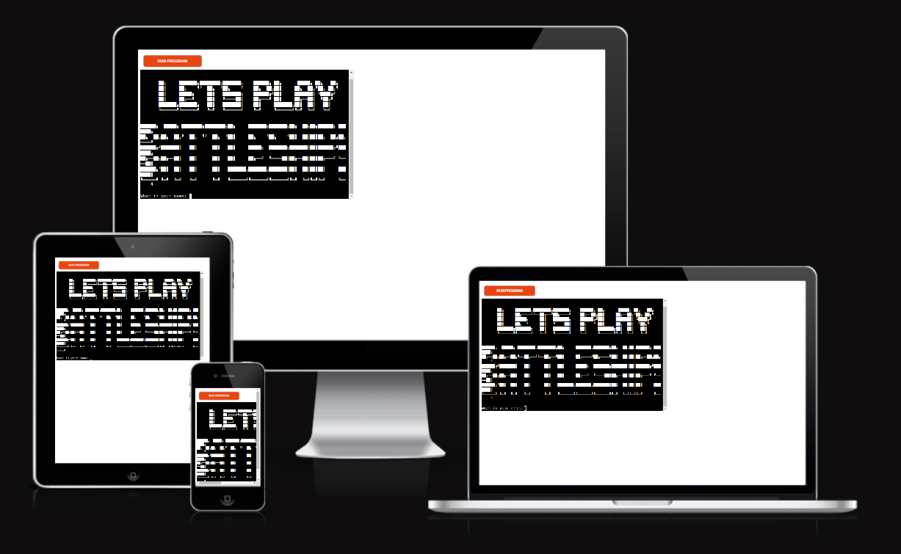
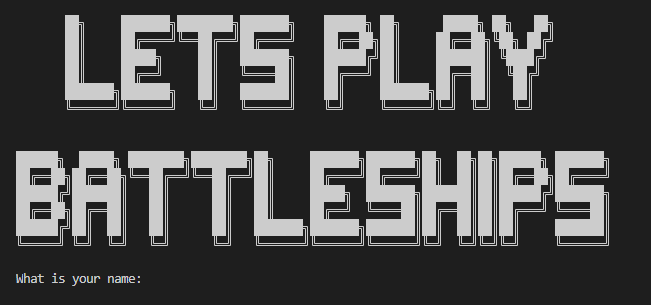
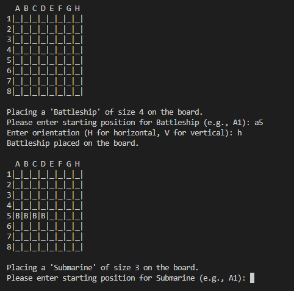
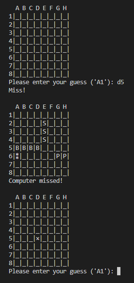
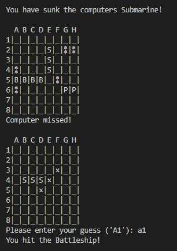
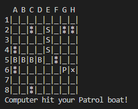
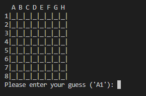
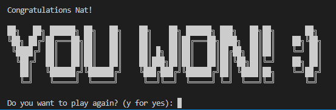
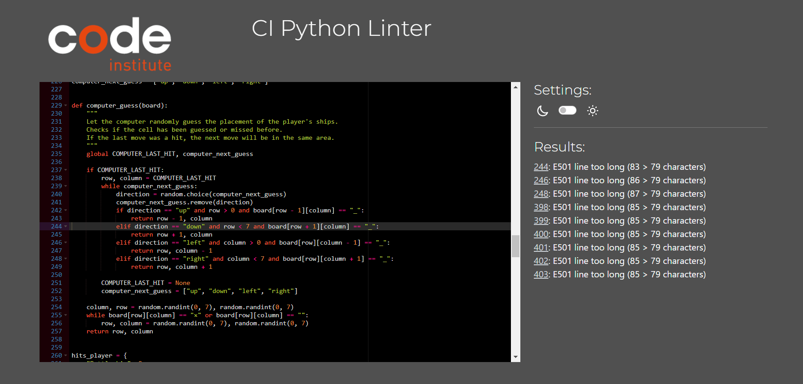

# **Battleships**
## **Site Overview**
The Battleship game is an engaging terminal-based duel between a human player and a computer opponent built in Python. In this classic naval combat game, both players strategically place their fleet of ships, including Battleships, Submarines, and Patrol boats, on a grid. Once the ships are set, the players take turns guessing the location of their opponent's vessels. 

The game provides real-time feedback, updating the board to show hits and misses, and informing players when they've struck or sunk an adversary's ship. The computer opponent, not just relying on random guesses, adapts its strategy if it scores a hit, targeting nearby cells in a more calculated manner. Gameplay continues until one player successfully sinks all of the opponent's ships. With clear visual representations, input validations, and the option to replay, this Battleship rendition offers a comprehensive and immersive experience right in the terminal.
​

​
## Table of contents:
1. [**Site Overview**](#site-overview)
1. [**Planning stage**](#planning-stage)
    * [***Target Audiences***](#target-audiences)
    * [***User Stories***](#user-stories)
    * [***Site Aims***](#site-aims)
1. [**How to play**](#how-to-play)
1. [**Features**](#features)
    * [***Future Enhancements***](#future-enhancements)
1. [**Data Model**](#data-model)
1. [**Future-Enhancements**](#future-enhancements)
1. [**Testing Phase**](#testing-phase)
    * [***Bugs***](#bugs)
1. [**Deployment**](#deployment)
1. [**Tech**](#tech)
1. [**Libraries**](#libraries)
1. [**Software**](#credits)
    * [**Honourable mentions**](#honourable-mentions)
    * [**General reference**](#general-reference)
    * [**Content**](#content)
​
## **Planning stage**
### **Target Audiences:**​
* People who like to play Battleships. 
* People who enjoy strategic board games.
* People who prefer turn-based games over real-time games. 
* People looking for a quick and engaging game during short breaks.
​

### **User Stories:**
* As a user, I want to be able to place my own ships on the game board.
* As a user, I want to input my guesses easily with as few clicks as possible.
* As a user, I want to know when my ships are hit or sunk. 
* As a user, I want to see the entire game board, so I can strategize my next move. 
* As a user, I want to be able to restart the game quickly if I wish to play again.

### **Site Aims:**
* Introduce users to the basics of strategy games and logical thinking.
* Provide an interactive platform for users to play Battleships online.
* Offer a user-friendly interface. 
* Ensure the game is playable without requiring any special packages or installations.
​

## **How to play:**
The goal of Battleship is to sink all of your opponent's ships before they sink yours.

### **Setup**
1. Each player has two game boards: one for their own ships and another for recording their guesses on the opponent's board.
2. Players will place their ships on their board. Each ship can be placed either horizontally or vertically.
3. The computer will automatically place its ships on its board.

### **Gameplay:**

1. Placing Your Ships:
* The game will prompt you to place each of your ships on your board.
* For each ship, you'll be asked to provide a starting position (e.g., A1) and an orientation (H for horizontal or V for vertical).
 Ensure that your ships do not overlap and that they fit within the board boundaries.

2. Taking Turns:
* Players take turns guessing the location of the opponent's ships.
* To make a guess, enter a coordinate (e.g., B3). If you hit a ship, the board will mark that position with the ship's character. If you miss, the board will mark that position with an "X".
* The computer will then make its guess. If it hits one of your ships, your board will mark that position with an "X". If it misses, your board will mark that position with a "⁑".

3. Sinking Ships:
* When all the positions of a ship have been hit, that ship is considered sunk.
* The game will notify you when a ship has been sunk.

4. Winning the Game:
* The game continues until one player has sunk all of the opponent's ships.
* If you sink all of the computer's ships before it sinks yours, you win! If the computer sinks all of your ships first, it wins.

After a game concludes, you'll have the option to play again or exit.

## **Features**
**Data Model**
The game uses a combination lists and dictionaries to represent the game state and manage gameplay. Three primary boards are utilized: `HIDDEN_BOARD`, `GUESS_BOARD`, and `PLAYERS_BOARD`. While `HIDDEN_BOARD` keeps the computer's ships concealed, `GUESS_BOARD` displays the player's guesses, and `PLAYERS_BOARD` showcases the player's own ships and the computer's guesses. Only the `GUESS_BOARD` and `PLAYERS_BOARD` are visually presented to the player using the `print_board` function.

The game's fleet is managed through the `SHIPS` dictionary, which holds essential details about each ship, such as its size, representative character, and sunk status. To aid in gameplay, counters like `PLAYER_SUNK_COUNT` and `COMPUTER_SUNK_COUNT` keep track of the number of ships sunk by each side.

The computer's guessing strategy is facilitated by the `COMPUTER_LAST_HIT` variable and the `computer_next_guess` list, guiding its next move based on previous successful hits.

Additionally, dictionaries like `hits_player` and `hits_computer` monitor the number of hits each ship has taken. Utility data, such as the `letters_to_numbers` dictionary, assists in converting player input into board coordinates.

The game ensures a smooth experience by providing functions to validate user input, place ships without overlap, and handle the logic for both player and computer turns.

**1. Two player game**
* The game is designed for two players: the human player and the computer opponent. 

**2. Interactive ship placement**
* The game allows players to place their ships on the board manually. 
* This gives players a sense of control and strategy right from the start, allowing them to devise their own tactics for ship placement.

**3. Adaptive Computer Opponent:**
* Ships are placed randomly on the board.
* The computer opponent adapts its strategy based on previous hits, making the game challenging and engaging. 
* This ensures that players remain on their toes and can't easily predict the computer's next move.

**4. Intuitive Gameplay:**
* The game follows the traditional Battleship rules, making it familiar and accessible to those who have played the physical board game. 
* The input format for guesses is straightforward, ensuring a smooth gameplay experience.

**5. Feedback on Game Progress:**
* Users receive immediate feedback after each turn, informing them if they've hit or missed an opponent's ship. 
* This keeps the excitement levels high and provides a sense of achievement with each successful hit.

**6. Clear Instructions and Legends:**
* The game provides a clear legend at the beginning, explaining the symbols used on the game board. 
* This ensures that players understand the board's state at any given time, enhancing the user experience.

**7. Game End and Restart:**
* Once all ships of a player are sunk, the game announces the winner with a visually appealing message. 
* Users can then choose to restart the game, offering replayability and the chance to refine their strategies.

### **Future-Enhancements**
* Adding player vs player option.
* Adding a scoreboard both in the beginning and end to show improved performance,
* Choose size of board and number of ships.
* Option to choose limited turns and time.
​
## **Testing Phase**
We have tested the game simultaneously throughout development. Every function has been tested independently as well when running the program. Tests are described below and if bugs were found they are described under [Bugs](#bugs) .

### **Functionality**
#### **Valid input from user**
The user makes several inputs playing the game, each input has been tested independently and all works as expected.

##### **1. Input from user**
* **Name of player**
    * **Description:** When starting the game, the player needs to enter its name to be able to continue. The input is limited to only letters. 
    * **Tests:** 
        * 1. We have tested to enter a name several times and continue the game.
        * 2. We have tested to enter numbers in the input, the game asked us to enter our name with letters only.
    * **Result:** Works as expected.
 

* **Row and column for placing ships**
    * **Description:** The user is placing the ships by choosing a starting position in format column + row ('A1', letter + number), and the enter if the orientation is horizontal ('H') or vertical ('V').
    * **Tests:**
        * Starting position
            * 1. Input with correct format - A1, works as expected.
            * 2. Input with incorrect format - Only letters, error message appears.
            * 3. Input with incorrect format - Only number, error message appears.
            * 4. Input with incorrect format - Only number or letter, error message appears.
            * 5. Input with incorrect format - To long input two letters + number, error message appears.
            * 6. Input with incorrect format - To long input one letter + two numbers, error message appears.
            Error message appearing: *"Please enter starting position for Battleship (e.g., A1):"*

        * Orientation
            * 5. Input in correct format - 'H' for horizontal orientation, works as expected. 
            * 6. Input in correct format - 'V' for vertical orientation, works as expected
            * 7. Input with incorrect format - One letter, error message appears.
            * 8. Input with incorrect format - Three letters, error message appears.
            * 9. Input with incorrect format - One number, error message appears.
            * 10. Input with incorrect format - Number + letter, error message appears.
            Error message appearing: *Invalid orientation. Choose 'H' or 'V'. Enter orientation (H for horizontal, V for vertical):*
    * **Result:** Works as expected.

* **Row and column for guess**
    * **Description:** When user makes a guess the format is limited to column + row ('A1'), before we started testing we realised that the format was the opposite of the the ship placement ('1A'), more described under [Bugs](#bugs). This to make the inputs less confusing for the user. 
    * **Test:**
        * 1. Input with correct format - A1, works as expected.
        * 2. Input with incorrect format - Only letters, error message appears.
        * 3. Input with incorrect format - Only number, error message appears.
        * 4. Input with incorrect format - Only number or letter, error message appears.
        * 5. Input with incorrect format - To long input two letters + number, error message appears.
        * 6. Input with incorrect format - To long input one letter + two numbers, error message appears.
        Error message: *"Invalid input. Please enter your guess (e.g., '1A', '2B'):"*
    * **Result:** Works as expected.

* **Restart game**
    * **Description:** When game ends the player can choose to restart the game by using "Y" for yes and any other key for no.
    * **Test:**
        * 1. Input "Y" - The game is restarted.
        * 2. Input any other key - The game thanks the player and says goodbye.
    * **Result:** Works as expected.

##### **2. Clear terminal**
**Description:** The terminal clears after entering name
**Test:**
* Testing if the terminal clears when continuing the game after entering the name. 
**Result:** Works as expected.

##### **3. Validation for ships placement**
**Description:** The user chose where to place the ships on the board by entering starting position and orientation. The game checks if there already is another ship placed in the chosen cells and that the ship's placement is inside the board. Prints messages when all ships are placed on board.

**Tests:**
* 1. Valid placement - Starting position ('A1') and orientation ('H'), the ship is being placed marked with the first character of the ship's name.
* 2. Invalid placement - On an already placed ship, an error message appears.
Error message: *"Another ship is already in that position."*
* 3. Invalid placement - Outside of the board (tested both horizontal and vertical) , an error message appears.
Error message: *"Ship placement out of bounds, try again."*
* 4. Valid placement for all ships - Success message printed *"All ships have been successfully placed!*
**Result:** Works as expected.

##### **4. Delay** 
**Description:** The terminal add a delay when user placed ships, between guesses, before restart option appears

**Test:** When playing the game we tried to change the time in the `time.sleep()` function to see if the delayed time changed and decide what would be suitable for delay, ending up with 1 second.

* **Result:** Work as expected.

##### **5. User hits, misses, sunk ship and second guesses**
**Description:** When a user hits one of the computers ships, it is marked on the board with the first character of the ship's name and a miss is marked with an 'X'.

**Test:**
* 1. Input guesses that hit ship, when hit, the first character of ship name appears on the game board and prints a message telling the user which ship was hit. 
Message: *"You hit the  [Name of ship]!"*
* 2. Input guess that misses ship, marked with '×' on game board and a message telling the user it missed.
* 3. Input guess for hit placement, error message appears.
* 4. Input guess for missed placement, error message appears.
Error message: *"You already guessed that, try again."*
* 5. Messages prints when the user sinks a ship. 
Message: *"You have sunk the computers [Name of ship]!"*

**Result:** We found a bug described in [Bug](#bugs). After solving the issues it works as expected.

##### **6. Computer hits, misses, sunk ships and next guess**
**Description:** When the computer hit one of the playes ships, the first character of the ship is changed to '×' and a miss is marked with an '⁑'.

* 1. Computer hits ship, first character of ship name changes to '×' on players board, print message telling user computer hit ship appears.
* 2. Computer misses ship, marked with '⁑' on game board and print message telling the user the computer missed.
* 3. Messages prints when the computer sinks a ship.
Message: *"The computer has sunk your [Name of ship]!"*
* 4. When the computer hits a ship but does not sink it, the next guess should be in the nearby area. We have tested this by printing the next guess in the terminal.

**Result:** Works as expected.

### **Validators**

**PEP8 Online Validator**
Results showed 9 errors, "E501 line too long".
* Line 244, 246, 248: are related to the check the next guess for the computer in relation to the last hit. When trying to split the line, the function does not work as expected. So we have decided not to make any changes.
* Line 398-403: are all related to the ASCII art which is used on the start screen. This error does not affect the functionality of the game while contributing to a better experience for the user.

### **Bugs**
#### **During development**
1. **Input of row and column**
    * Issue - During development we realised that the formatting of input for row and column differed between when the player would add ships (e.g. 'A1') and make guesses (e.g. '1A'). 
    * Resolution - To fix this we changed the order of the valid pattern, so the letter would come first and the number after instead of the opposite that it was from the start.
 

2. **Computers guess**
    * Issue - When adding the function to make the computer guess the placement of the players ships we realised that the computer only was checking the location of the players guess on the `HIDDEN_BOARD`, not actually guessing the the location of the playes ships on the `PLAYERS_BOARD`.
    * Resolution: We change `row` and `column` to `computer_row` and `computer_column` when calling the `computer_guess` function to capture the values of the computer's guess and update the `PLAYERS_BOARD` accordingly.
 

3. **Player could not guess again on repeat guess**
    * Issue - When the player tried to guess at the same place a previous guess was made, the game asked the player to try again while the code continued, preventing the player from making another guess until the next round. 
    * Resolution - By adding a `continue` statement we ensure the player would get a new try before the computer made its guess.
 

4. **Count sunk ships and print what ship have been sunk**
    During development we encountered several issues when trying to count the sunken ships before we could find a solution that fitted our needs and wishes. The main problem was that the counter for the player would interfere with the counter for the computer, and vice versa.

    * Issues
        - The computer won after making its first move.
        - The counter would only count each ship one time per a round e.g. if the player sank the computer's Battleship, it would not be counted when the computer would sink the player's Battleship and so on.
        - When counting the characters of the ships compared to size the computed ships would not be counted accurately. 
        - When adding counting "X" to the function, since the computer's hits become "X" on the `char`, the player's ships would not be counted accurately.

    * Resolution - By not refactoring the function and moving the separate logic into the players and computers turn logic, the problem was solved and behaves as expected.

5. **Check if cell already been guessed**
    During development testing we realised the error message for guessing the same cell twice did not appear if the user had a hit in the particular cell.

    * Issue - Users could guess the same cell twice without the game warning and the computer continued guessing which led to the user getting fewer guesses than the computer.
    * Resolution - By creating a variable `ship_chars` that iterates over the values of the `SHIPS` dictionary and adding it to the validation method checking if the cell has already been guessed we could solve the problem.
​
***
## **Deployment**
This project was deployed to Heroku through the following process:

### **Setting up app**
1. Log in to [Heroku.com](https://heroku.com)
2. Clicked the button labelled **"New"** on the dashboard in the top right corner under the profile picture.
3. Choosing **"Create new app"** from the dropdown menu.
4. Enter a **unique** name, we chose ***battleships*** since "Battleships" was already taken.
5. Choosing a region, we chose Europe since it is the most relevant.
6. Click button labelled **"Create app"** and come to the projects **"Deploy"** tab.

### **Settings tab**
7. Click the **"Settings"** tab and navigate to **"config Vars"** section.
8. Added **`PORT`** as and **`8000`** as value, then clicked **"add"**.
9. Scroll down to **"Buildpacks"** section, clicking **"Add buildpack"** and then selection **"Python"**.
10. Repeating the process above but adding **"Node.js"** instead of "Python".

### **Display tab**
11. Click **"Deploy"** in the tabs menu.
12. Chose **GitHub** as **"Deployment method"**.
13. Confirm connection. 
14. Search for the repository name and click **"Connect"**. 
15. Chose **"Automatic deploys"** or **"Manual deploys"**.

Final deployment is found [here](https://btlships-7af56863800a.herokuapp.com/)
​
## **Tech**
* Python

## **Libraries**
* Random - Used to generate random place computers ships and for computer guesses. 
* RE - Used to check valid input patterns of users' guesses.
* SYS - Exit the game if the user does not wish to play again.
* OS - Used to clear terminals so the user has a clearer view of the game.
* Time - Used to delay the computer's guess so that the user can easily follow along.

## **Software**
* VS Code to create, load and push my code to GitHub.
* [patorjk.com](https://patorjk.com/software/taag/#p=display&f=ANSI%20shadow=Battleships) for ASCII art.
​
## **Credits**
### **Honourable mentions**
* Richard Wells, my mentor, who is always very supportive and helpful. This project would not be possible without his help, so a very big thanks to him.
​
### **General references:**
* All code is written by myself. 
* I have used [ChatGPT](https://openai.com) when I got stuck and could not figure out how to get forward. I have not asked ChatGPT to write code for me without contributing my own code to be fixed. 

### **Content:**
* Introduction, winner and loser ASCII art graphics from [patorjk.com](https://patorjk.com/software/taag/#p=display&f=ANSI%20shadow=Battleships)
​